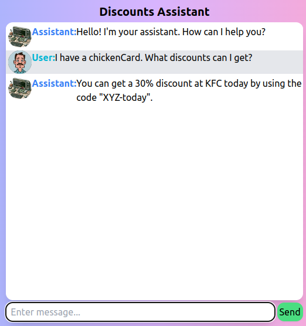

This is a project for an AI assistant that will guide free or subscribed users to retrieve discounts from a database.

Features:
- basic json database for users and discounts
- jwt tokens for authentication
- bcrypt for password hashing
- API for CRUD operations on both databases
- Stripe payments
- File upload to easily update database
- OpenAI integration with database using a chain (user prompt - gpt model generates query - server queries the database - server prompts gpt model - user gets response)

User flow:
- User logs in or signs up
- User is greeted by assistant
- User asks the assistant about discounts
- Assistant responds with relevant discounts
- User can pay/donate for the service
- User can ask the assistant to add a discount

Admin:
- Add discounts
- Update discounts
- Delete discounts
- Add users
- Delete users

